# morphcpu build journal

**Total time: 129h**

build log. spatially-reconfigurable processor on a small low power fpga.
eleven sessions 129h of actual keyboard time

most of it went on two things and neither was the fun part. reading the power up
sequence properly, and routing a QFN-48 on 0.5 mm pitch out through a fanout that
turned out to have less room in it than it needed

the date on a session is the day its commits landed, thats all it is. six of them
landed the same evening, the work behind them didnt. dont divide the dates into
the hours. template is in [docs/journal-template.txt](docs/journal-template.txt)

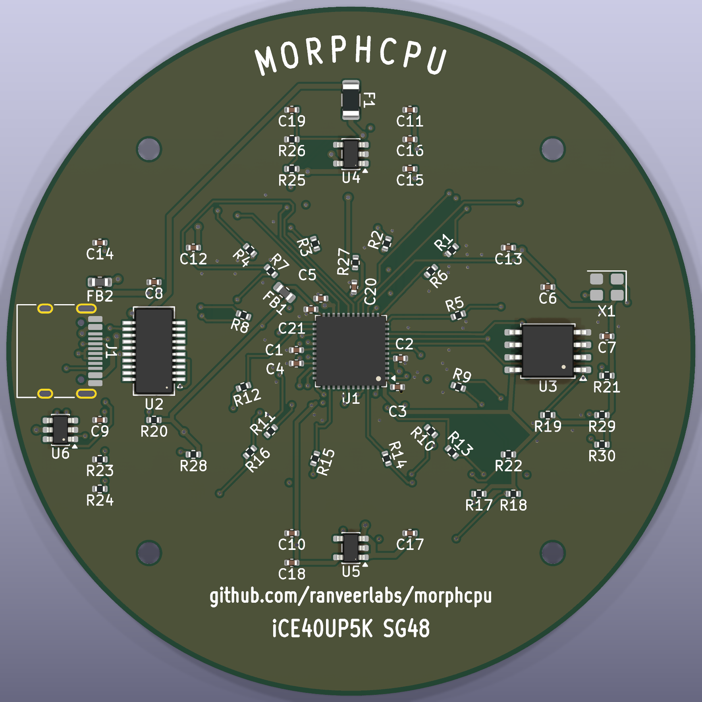

where its at rn. 770 tracks 148 vias, 0 DRC violations, 2 nets still open and
both of them are leds

| # | date | time | focus |
|---|---|---|---|
| 001 | 2026-08-18 | 2h | repo + scaffolding |
| 002 | 2026-08-18 | 14h | fabric rtl + fabric testbench |
| 003 | 2026-08-18 | 12h | end to end uart testbench, build flow, constraints |
| 004 | 2026-08-18 | 9h | case, parametric cad |
| 005 | 2026-08-18 | 16h | electrical design spec + bom |
| 006 | 2026-08-18 | 3h | readme restructure |
| 007 | 2026-08-22 | 21h | datasheet items closed, schematic, pcb placement |
| 008 | 2026-08-28 | 26h | 4 layers, first copper, 0 violations |
| 009 | 2026-08-30 | 24h | fanout was full, six pins moved |
| 010 | 2026-08-30 | 1h | ldo went out of stock, en divider was wrong |
| 011 | 2026-08-30 | 1h | silkscreen, the board had none |

---

## session 011 - 2026-08-30

**Time spent:** 1h
**Running total:** 129h

the only graphic on this board was the edge cuts circle. no name no rev nothing,
which someone pointed out is going to read as unfinished next to the actual
requirement, "Round your corners, add silkscreen art, remove empty space from the
PCB". corners were never an issue cuz its a 70mm circle, the other two were

kicad has no curved text so the title is eight separate PCB_TEXT items placed
round r=29.7 with each one rotated to the tangent. front got that, a frame circle
at 32.9, IN and OUT arrows on the west and east lobes pointing the same way cuz
thats the direction data actually moves, and eight little boxed arrows in the two
side lobes for the four directions a cell can route

three things that didnt work first. a cartesian lattice of small squares in the
annulus, culled against every footprint, came out looking like debris rather than
a pattern, the culling breaks the grid up into clumps. then a ring of 16 cells,
one per fabric cell, which is the idea i wanted, except the M2 holes sit at r=29
and their bounding boxes reach in to r=25.5 so the diagonals are pinched between
those and the led grid corners at r=21.8. swept radius against placement count and
the best was 13 of 16 at r=31, and r=31 is where the title already is

```
gs 2.6 off 11.25  R 31.0 -> 13/16
gs 2.6 off 11.25  R 31.5 -> 13/16
gs 2.6 off 11.25  R 32.0 -> 13/16
```

third one was my own bug, i was culling front silk against every footprint
including the back ones, so half the glyphs vanished for parts that arent on that
side. only front footprints and anything with a through hole pad block front silk

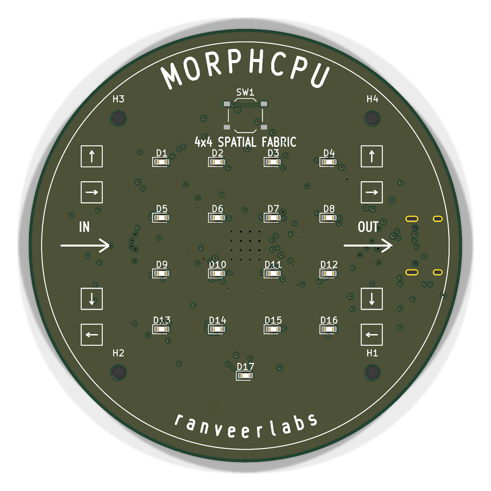

back arc came out UPCHPROM the first time. mirroring a layer flips the whole run
and not just each glyph so the string has to go in reversed. and the first back
pass threw 4 silk warnings, the frame circle crossed J1's outline at 182,95.3 and
182,104.7 and the full url arc ran its c and its t straight into the H3 and H4
NPTH pads. dropped the circle on that side and the url is straight text in the
bottom band now, arc up top is just the name

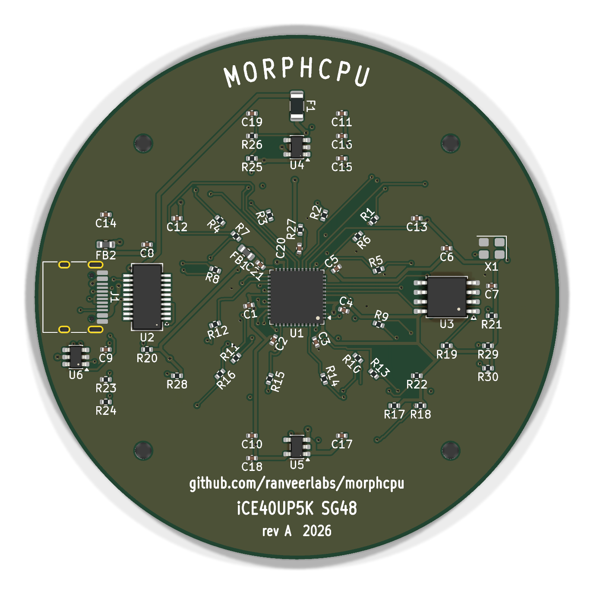

```
$ kicad-cli pcb drc --severity-all hardware/morphcpu.kicad_pcb
Found 0 violations
Found 2 unconnected items
```

same 2 open leds as before, no copper moved. the empty space one im leaving, the
components sit inside about 40mm and the board is 70 cuz the case is built round
70 and the led grid wants the room, shrinking it now means re routing the fanout
again with a week to go

---

## session 010 - 2026-08-30

**Time spent:** 1h
**Running total:** 128h

C82942 hit 0 stock at JLC, 11 day lead and a 196 MOQ sitting behind it, so the
3V3 regulator is an AP2112K-3.3TRG1 now, C51118, 70,670 in stock. same SOT-23-5
and the same 1 VIN 2 GND 3 EN 4 NC 5 VOUT pinout so nothing on the board moved,
600 mA instead of 500. i couldnt get a tier out of JLC's listing for it, that
column came back Extended for every row i searched including parts that arent,
so idk, read it off the quote

then the actual find. the RC holding 3V3 off until 1V2 is up has a 100k feed and
what was a 10k bleed, and those two are a divider. EN sat at 5 x 10k/110k =
0.45 V, under the enable threshold of any LDO in this class, so the 3V3 rail
would never have come up at all. tau was 0.9ms not the 10ms this was documented
at, that number was 100k x 100n with the bleed left out of the sum. bleed is 1M
now, C26083

    EN  = 5 x 1M/1.1M              = 4.545 V
    tau = (100k || 1M) x 100n      = 9.09 ms

0402 to 0402 so no footprint moved. i checked rather than assumed, all 12 gerbers
came back identical to the previous plot once the creation dates are stripped

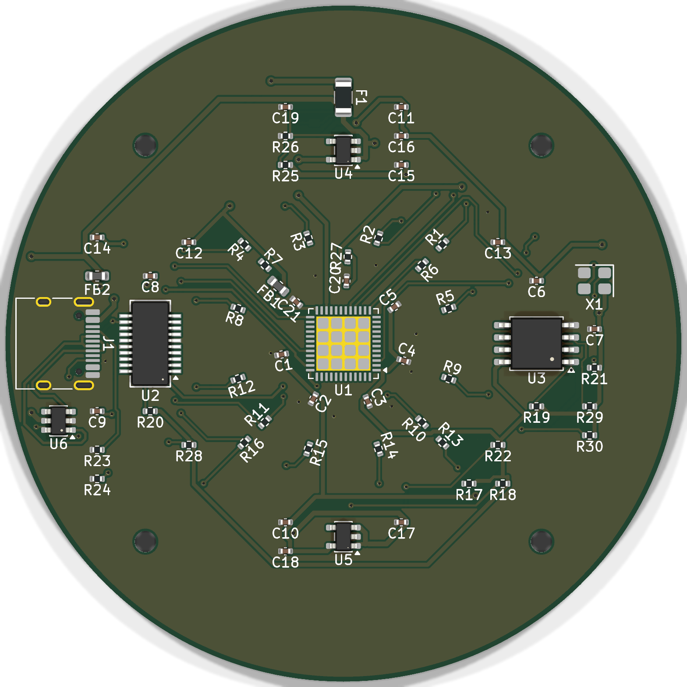
the back, and U1 actually renders now. the footprint asks for
QFN-48-1EP_7x7mm_P0.5mm_EP5.6x5.6mm.step and KiCad only ships the EP5.15x5.15mm
one, so the fpga was just absent from every 3D export. pointed at EP5.15, BOM and
CPL came back byte identical after, J1 SW1 and X1 are still missing models

```
$ kicad-cli sch erc --severity-all hardware/morphcpu.kicad_sch
Found 0 violations
$ kicad-cli pcb drc --severity-all hardware/morphcpu.kicad_pcb
Found 0 violations
Found 2 unconnected items
```

real 4 layer quote came back $203.73 all in, $40.75 a board, $6.27 under the
$210 cap. the old $198.41 was 2 layers. parts on their own are $88.27 and thats
already inside the JLC number, not on top of it

case has a STEP at last. FreeCAD 1.1.3, 3MF in, sew the mesh, solid out. closed,
75.4 x 75.4 x 7.8mm, 2621 faces, all of them triangles rather than real cylinders

next:
- [ ] move U3 north or move R2/R3, either takes the north fan under
- [ ] J1 SW1 X1 have no 3D models, only matters for renders

---

## session 009 - 2026-08-30

**Time spent:** 24h
**Running total:** 127h

seven connections would not route and every one of them had exactly one blocker,
which i only found out after fixing four bugs in my own router. it was rasterising
grid cells as half open squares in one function and as lattice points in the other
so every obstacle sat 0.025 mm off, and separately inflating obstacles by clearance
plus 0.01 mm when the tightest real clearances in this fanout are 0.2019 mm against
a 0.2 mm rule. that second one closes the channel it is measuring. hole to hole
checks were also reading the board's original track list which still had vias that
had just been ripped up, and a route's own vias never got checked against each
other so it happily put two holes 0.07 mm apart. with those four fixed the same
router went from reproducing nothing to reproducing every net already down

then the actual problem. a 0.6 mm via needs 1.2 mm between its neighbours and
adjacent escape rays on a 0.5 mm pitch QFN are 0.5 mm apart, so nothing can change
layer until the fan has spread, and U1's east column was carrying twelve nets on
twelve channels with four of them landing on the far side of the board. i tried the
staggered two row via fanout, which is the standard trick, and it fails the same
way, outer row's neck needs 1.2 mm between two inner vias and has 1.0 mm

so six pins moved instead. pads 37-48 were sitting completely unused

| Net | was | now |
|---|---|---|
| LED12 | 27 | 48 |
| LED9 | 23 | 9 |
| LED13 | 28 | 46 |
| LED14 | 31 | 38 |
| LED2 | 4 | 23 |
| LED3 | 11 | 27 |

LED12 LED13 LED14 went 42.0 / 36.1 mm and unroutable to 12.5 / 7.8 / 8.0 mm and
eleven of the twelve outstanding connections then routed with nothing ripped up.
netlist.py, the pcf and the DESIGN.md pin table all moved together, ERC still 0


the back after. QFN paddle in the middle with its via field, and the fan going out
in every direction, thats the bit that ran out of room

```
$ kicad-cli pcb drc --severity-all hardware/morphcpu.kicad_pcb
Found 0 violations
Found 2 unconnected items
```

LED1 and LED2 are the two, both route on their own, never together. moving LED1 to
pin 20 or 11 routes LED1 and opens LED7 or LED5 instead, the count just stays at
two whatever i do, so the north face is two nets past what it can fan out. leaving
it, cuz deadline. two of the sixteen grid leds dont light, everything else is
connected

fab_output replotted off the routed board while i was in there. gen_fab.py was
still on F.Cu,B.Cu from the 2 layer days so it had been dropping In1 and In2
entirely, which quotes fine and arrives dead

next:
- [ ] move U3 north or move R2/R3, either takes the north fan under
- [x] requote, $198.41 was 2 layers, the 4 layer number is $203.73

---

## session 008 - 2026-08-28

**Time spent:** 26h
**Running total:** 103h

went to 4 layers. 2 could not do it, the resistor ring and the decap ring both sit
inside the F.Cu keepout over the led grid so every led escape was stuck on B.Cu on
its own. In1 and In2 are signal layers now with GND pours on all four

freerouting got another go now that the keepout exists and the pours are filled and
it still isnt worth keeping. `-inc GND` does not exclude GND, it routes it anyway,
and with GND in the netlist a pass takes 462-494 s against ~30 s with the net block
deleted. it also ignores `(type fix)` on existing wiring, marking all 573 wires fix
gave a byte identical score to leaving them route, so you cant ask it to only fill
gaps. it stalled at 45-46 unrouted and 72 violations

wrote a grid maze router instead. 0.05 mm cells, 4 layers, 45 degrees, every
segment and via exact clearance checked against pcbnew geometry before it goes
down. got 167 unconnected pads to 7 across the pass

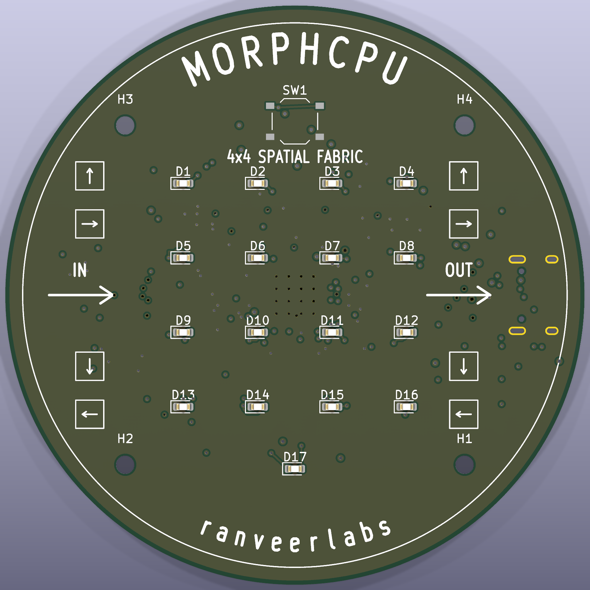
front stays clean, thats the whole point of the F.Cu keepout over the grid. the
only copper on this face is the CDONE led and the reset button

the GND pours needed watching. three pads ended up in isolated B.Cu pour islands
with the main In1/In2/F planes running straight underneath, so what they needed was
one stitching via each and not a route at all

---

## session 007 - 2026-08-22

**Time spent:** 21h
**Running total:** 77h

closed all 8 open items in the design spec against the family datasheet + the
symbol lib. one citation each. full 48 pin table lives in the spec now

picked the oscillator and pushed the clock change through gateware, constraints,
build script. generated the schematic off the netlist transcription and erc came
back 0/0 with everything turned on which ngl i did not expect first try

generated first pass placement through the layout api. 79 footprints 90 nets
zero tracks zero courtyard overlaps zero shorting pads. then grew the board
60mm -> 70mm cuz it just did not fit, and followed that through the case params

both regulators run off 5v in parallel now with an rc delay on the 3v3 enable.
the obvious way is the cascade 5v -> 3v3 -> 1v2, simpler and one less rail off
usb, but the datasheet wants core + pll up first then the spi bank then the
programming rail, and the cascade brings 3v3 up first which is exactly
backwards. every 3v3 consumer sits after core in the ordering so the whole thing
collapses to one rule, 1v2 has to hit 0.5v before 3v3 shows up. thats in the
power up supply sequence section plus the bit listing which rails the on chip
reset actually watches. downside is the 3v3 reg now needs an enable pin which
killed the part id already picked, rip. running 1v2 straight off 5v burns
~114mw in a sot-23-5, abt a 28c rise, fine

went 16mhz on the oscillator instead of 12. the two 12mhz parts i looked at had
9 units and 1 unit in stock, and nothing actually depends on 12, so it wasnt
much of a call. stock of 9 is how you end up redesigning at the worst possible
moment. uart divisor goes 104 -> 139 so the error drops 0.16% ->
0.08%, got better by accident lol, and the tick divider got rescaled to hold 4hz

board went 60mm -> 70mm. could've stayed at 60 and packed tighter but 60 gave
courtyard overlaps + shorting pads that only cleared if you put parts on top of
the mounting holes, which isnt clearing them. cost two numbers in the case
source and a re export. more board area, cost is nothing

datasheets and parts i had open for this:

| part / doc | exact p/n or ref | what i needed |
|---|---|---|
| fpga | ICE40UP5K-SG48I | pin summary, rail voltages, io current ceiling, power up sequence |
| symbol lib | `ICE40UP5K-SG48ITR` | sg48 pin numbers |
| oscillator | 1532H4-16000JWPDTSNL | 16mhz, 1.8-3.3v, hcmos, tri state enable on pad 1 |
| 3v3 ldo | ME6211C33M5G-N | 500ma, has the enable pin the sequencing needs |
| 1v2 ldo | ME6211C12M5G-N | 300ma, same footprint as the 3v3 one |

numbers that came out of it:

| metric | value | notes |
|---|---|---|
| supply pins | 7 | 2 core 3 io bank 1 pll 1 programming. so 7x 100nf |
| dedicated gnd pins | **0** | ground only reaches the die thru the exposed paddle |
| led drive | 5ma of an 8ma ceiling | fine |
| schematic | 87 symbols 90 nets 257 pins | erc 0/0 |
| pcb | 79 footprints 0 tracks | 0 courtyard 0 shorting 0 clearance |
| board | 70mm dia 2 layer | grid 9mm pitch 27mm across |

schematic export died with "failed to load schematic" and literally nothing
else, no line no detail. the 1v2 symbol only extends the 3v3 one, so emitting
the parent body under the child name leaves the nested per unit sub symbols
still named after the parent and the file wont load. rename just those and it
loads, then trips a symbol mismatch check instead cuz the properties still
read as parent. fix is embedding the derived symbol fully flattened, one function

placement generator segfaulted, no traceback nothing. flipping a footprint that
wasnt added to the board yet. bindings dont check ownership they just die. fix
is adding to board then flipping it

first placement pass came back 87 violations incl pads shorting straight across
the fpga. id put the 16 led series resistors 3.2mm from each led which parked
the entire ring on top of the qfn in the middle of the board, and 60mm wasnt
enough area anyway. fix is moving the resistors out to a ring at r=11.5mm and
growing the board

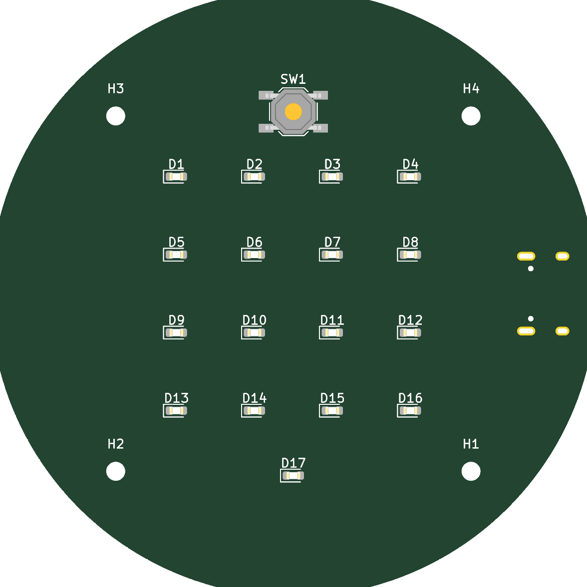
front face. 4x4 grid on a 9mm pitch owns the centre, nothing else allowed on
this side except the reset button and the done led

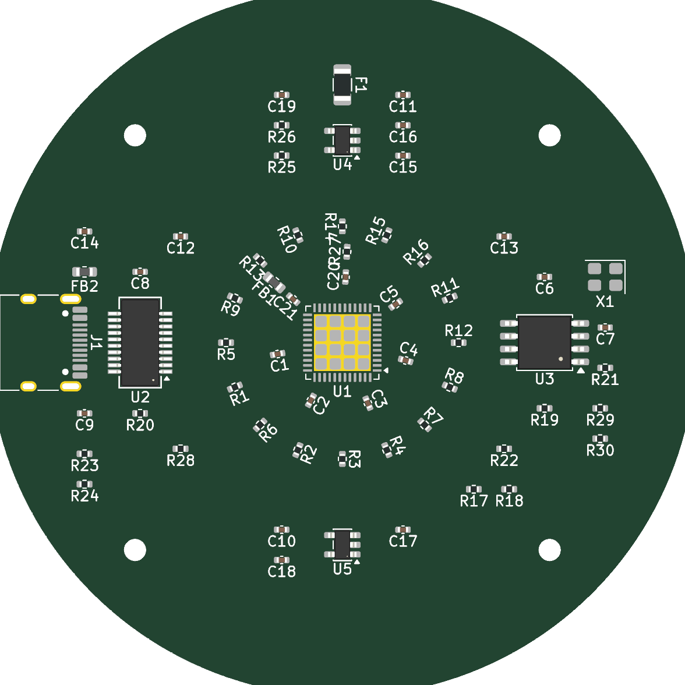
back face. rings around the fpga, decoupling innermost, anything with a real
body pushed past 17mm, diagonals empty for mounting holes

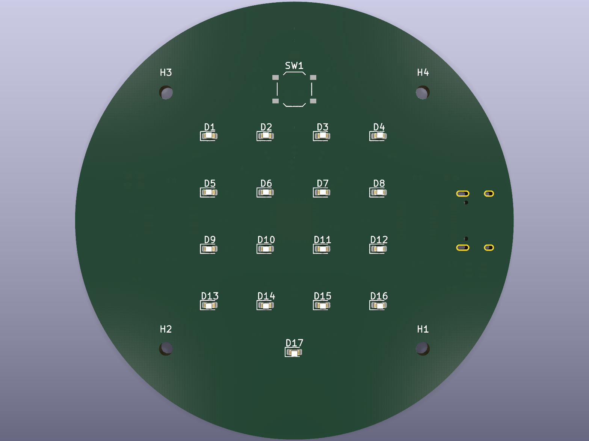
same placement in 3d. worth the check, cell 0 top left thru 15 bottom right row
major so the physical grid reads the same as the fabric map. get that backwards
and the whole demo lies to you

next:
- [ ] route the board by hand
- [ ] work the post routing checklist at the bottom of the design spec

---

## session 006 - 2026-08-18

**Time spent:** 3h
**Running total:** 56h

ripped the ai written project description + the how it works section out of the
readme and left marked placeholders. kept the generated stuff the rules do
allow, status table parts table grid diagram commands repo layout image embeds

tiny session and mostly bookkeeping but giving it its own entry cuz it changes
what the readme is allowed to contain from here on. thats exactly the kind of
thing you forget three sessions later and then undo by accident


this session only edited text so theres no artifact of its own. this is the
image the readme leads with, which is the point tbh, embeds and tables and part
numbers are exactly the stuff the rules do allow. the prose around it is what
had to come out

next:
- [ ] write the readme prose by hand
- [ ] figure out if the rule covers the other docs too

---

## session 005 - 2026-08-18

**Time spent:** 16h
**Running total:** 53h

wrote the design spec. power tree, net by net tables, decoupling per power pin
group, pcb brief, assembly notes, and 8 open datasheet items i couldnt close yet

wrote the bom for a 5 unit run. six parts verified w real stock, anything
unpinned listed with no price instead of a guess. added a polarity param to the
top level so the schematic can pick led orientation without touching gateware

the two below are the ones that mattered. this chip has no crystal amp, and the
obvious power cascade is backwards. both changed the parts list and tbh both are
things id have got wrong if id trusted the reference designs floating around
instead of just reading the datasheet

added two regulators that were not in the plan at all. running the fpga straight
off usb 5v is impossible, core is 1v2 and the io banks are 3v3, and usb-c gives
you 5v so nothing in the original parts list made either rail. idk how i just
didnt think about power. rail numbers are in the recommended operating
conditions table. costs two more parts

the clock is an active oscillator module not a bare crystal. options were a
passive crystal + load caps, or the internal osc which is free and zero parts
but abt ±10% untrimmed. theres no crystal amp on this family and no xin/xout
pair in this package so it physically cannot start a passive crystal, and 115200
tolerates abt ±2-3% total so ±10% wont enumerate reliably. the oscillator usage
guide says the family gives you the two on chip oscillators and nothing
external. so the part becomes a 4 pad module and the two load caps disappear.
still worth wiring the internal osc as a gateware fallback so an unpopulated
part doesnt brick the board

swapped the usb-uart bridge to the tape and reel variant. the tube packaged one
i originally specified was out of stock, and tube isnt what an assembly line
wants anyway. same silicon same footprint no pin changes, so functionally
nothing changes

datasheets and parts i had open for this:

| part / doc | exact p/n or ref | what i needed |
|---|---|---|
| fpga | ICE40UP5K-SG48I | rail voltages, programming rail range |
| usb-uart | FT231XS-R | packaging variant, footprint confirm |
| config flash | W25Q32JVSSIQ | pinout, quad mode pins to tie off |
| usb-c | TYPE-C-31-M-12 | pin map, cc pulldown requirement |
| led | KT-0603R | forward voltage 1.8-2.4v, brightness at 20ma |
| datasheet | family datasheet | rail voltages, programming rail range |
| tech note | oscillator usage guide | on chip oscillators only, no external crystal |

numbers that came out of it:

| metric | value | notes |
|---|---|---|
| led current | 5ma each, 80ma total | 270Ω from 3v3, vf abt 2.0v |
| open items | 8 | all pin count or rail voltage dependent |

couldnt read the datasheet pdf locally to confirm the exact supply pin counts,
no pdf tooling installed. so instead of guessing i left every pin count
dependent decoupling qty as an explicitly open item, 8 of them, all listed in
the spec. guessing here quietly propagates into the schematic and then you never
catch it

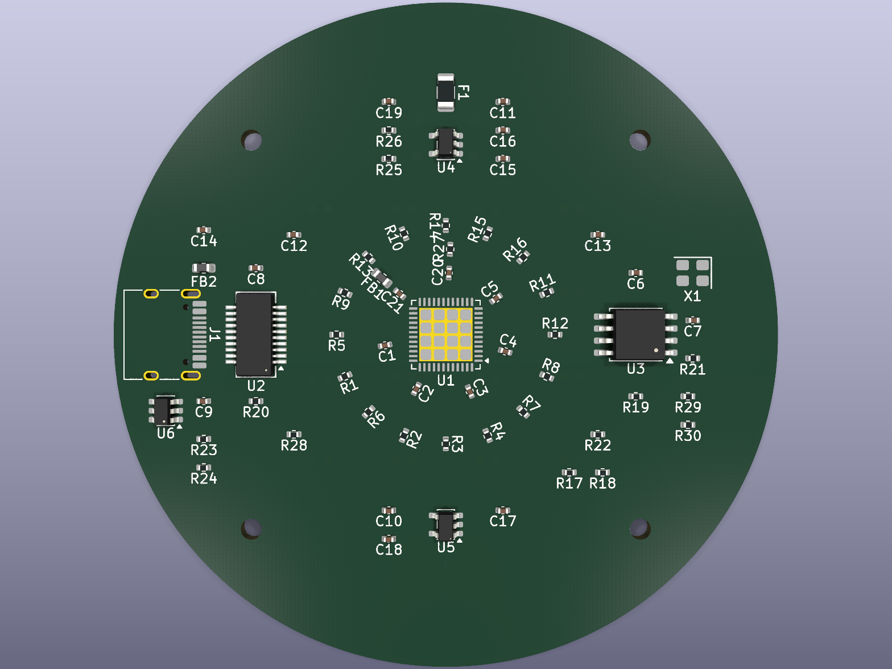
nothing visual existed this session, its all tables. this is the back of the
board from two sessions later, but its every part the power tree here settled
on, the two regulators, the flash, the oscillator and the bridge, sat where they
ended up. easier to check a parts list against a picture than against a netlist

next:
- [ ] close the 8 open datasheet items
- [ ] pick the osc and the 1v2 reg
- [ ] start the schematic

---

## session 004 - 2026-08-18

**Time spent:** 9h
**Running total:** 37h

wrote the case as parametric source. slim open face frame, four standoff posts,
usb-c cutout w an outer relief so a moulded plug boot clears the rim, eight
vents in the floor. exported mesh formats both manifold. export script
regenerates the exports + the preview renders in one go

open face, no lid, no light pipe. could've done a closed case with a window or a
light pipe array over the leds but the grid is the demo, and anything over it
costs brightness and adds an alignment problem for zero benefit. board front
ends up exposed which is fine for a desk object

every board derived dimension is a named param. the pcb didnt exist yet so all
seven board dims were assumptions, and parameterising them means the finished
layout is a seven number edit + re export instead of a remodel. only catch is i
have to actually remember to update them, so theyre a table in the case readme
where theyre hard to miss. paid off immediately in 007 when the board grew

numbers that came out of it:

| metric | value | notes |
|---|---|---|
| outside dia | 65.4mm | 60 board + 0.6 fit + 4.8 wall. now 75.4, board grew to 70 in 007 |
| height | 7.8mm | 2.0 floor + 3.0 standoff + 1.6 board + 1.2 rim |
| mesh | 4,769 verts / 9,582 facets | manifold genus 12 |

export to step failed with "invalid suffix step". this tool cannot export step
at all ever, its a mesh/csg modeller and step is a boundary rep format so theres
literally nothing to write out. fix is exporting mesh formats instead and
documenting the two real routes to a step file if one is ever needed, both in
the case readme


frame w a mock board dropped in. open face, board sits on four standoff posts,
3mm of air underneath for back side parts


printable part by itself. 2.4mm wall, eight lightening holes in the floor, no
lid no light pipe cuz the grid is meant to be looked at directly

next:
- [ ] update the seven board params once the outline is fixed
- [ ] test print, check the fit clearance

---

## session 003 - 2026-08-18

**Time spent:** 12h
**Running total:** 28h

wrote an end to end testbench that drives the design only thru its uart pins,
so it tests the wire protocol + the config bit packing not just the fabric. 5/5

wrote the sim runner, build script, pin constraints. wrote up the protocol table
and a worked add two numbers example that matches the testbench byte for byte

fabric tick defaults to 4hz not full clock rate. a hop every 83ns is invisible
and the board exists to be watched. tradeoff is that at full tick rate the
fabric outruns the serial link and results get dropped, which is exactly why the
single step command exists

numbers that came out of it:

| metric | value | notes |
|---|---|---|
| serial | 115200 8n1 | 0.16% divisor error at the clock i was on then |
| config chain | 64 bits | 16 cells x 4 bits |
| checks | 5/5 | end to end testbench |

end to end test timed out, no byte ever came back. thought it was config not
loading. was actually two bugs stacked which is why it took a while. the shift
enable was a registered output while the shift register shifted combinationally
so the enable lagged a cycle and the first config bit never got captured. and
the top level sampled the east edge on the tick edge itself which always caught
the pre tick state, one hop stale, so a result never latched. fix is making the
enable combinational and adding a one cycle delayed tick for sampling the edge

neither bug was visible to the fabric level testbench cuz that one drives the
config chain directly and reads the edge after the tick. good argument for
testing thru the real interface and not just the convenient one

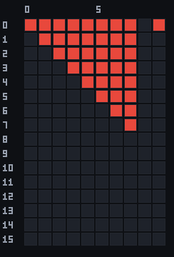
leds through the end to end run, every column is a state change. this one is
driven entirely over the serial link, nothing reaching into the hierarchy. fills
in as a triangle rather than a diagonal cuz the leds are pulse stretched to
~150ms so a single tick visit stays visible, so the trail hangs around. cells 0
thru 7 light in order which is the worked add example, 0 south into 4 then east
out thru 5 6 7

next:
- [ ] get the synth toolchain installed, run the build for real utilisation numbers

---

## session 002 - 2026-08-18

**Time spent:** 14h
**Running total:** 16h

wrote the whole fabric. the cell, the grid + neighbour interconnect, serial rx
and tx, config loader and tick gen, top level. then a fabric testbench, 13
checks, exact per tick latency, all four ops, both convergence cases, config
surviving a data clear, and the activity taps that drive the leds

a second converging stream is the alu's second operand. alternative was a fixed
neighbour operand or an immediate field in the config, but doing it this way
makes add and xor mean something spatially, two streams meeting in a cell get
combined, and it costs zero extra config bits. a lone stream falls back to
whatever the cell already holds which turns add into an accumulator for free.
operand order ends up depending on the fixed n,e,s,w priority scan so thats
documented and asserted in the testbench where it cant drift

config chain is wired highest cell index first. costs one crossed over wire
inside the fabric which is free, and makes the host byte order natural, byte i
holds cells 2i and 2i+1 ascending with nothing to reverse on either end

numbers that came out of it:

| metric | value | notes |
|---|---|---|
| grid | 4x4, 16 cells | 8 bit datapath |
| config | 4 bits/cell, 64 total | 2 op + 2 direction |
| checks | 13/13 | fabric testbench |

syntax error on a module header that looked completely valid. first thought was
something in the comment header, and backtick quoted words inside `//` comments
do get seen by the preprocessor and do break parsing, so that was a real
find, just not this bug. actual cause is that `cell` is a reserved word in
verilog-2001, belongs to the configuration construct. fix is renaming the
module. genuinely annoying to find

then every fabric test failed with nothing lighting up at all. testbench race,
not an rtl bug. stimulus was driven on the same rising edge the design samples
on so the tick got cleared before the design ever saw it. fix is all stimulus
changing on the falling edge

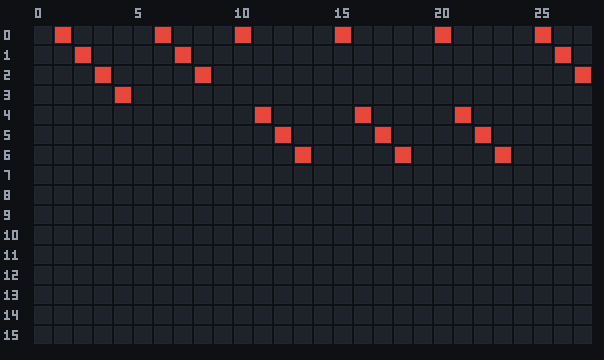
the 16 activity taps, one row per cell, one column per tick. straight off the
sim dump w `vcd_png.js`. every diagonal streak is one value physically walking
east one cell per tick, 0 -> 1 -> 2 -> 3 along the top row and 4 -> 5 -> 6 along
the next. thats the idea in one picture. also the fastest way
to spot a routing bug, a value going the wrong way slopes the wrong direction

next:
- [ ] test thru the real serial interface not just the fabric ports

---

## session 001 - 2026-08-18

**Time spent:** 2h
**Running total:** 2h

initialised the repo, folder structure, readme skeleton, this journal, ignore
file. nothing interesting tbh. but starting the journal at 001 instead of
backfilling it later is lowk the only reason the rest of these entries have any
real detail in them


being straight w you, this session produced empty directories and a gitignore.
theres nothing to photograph. so this is the board six sessions later, ie what
those folders ended up holding. gateware/ hardware/ case/ docs/ were all decided
here and none of them moved after, which is the only reason this entry is worth
keeping at all

next:
- [ ] define the cell opcode + routing direction encoding

---
