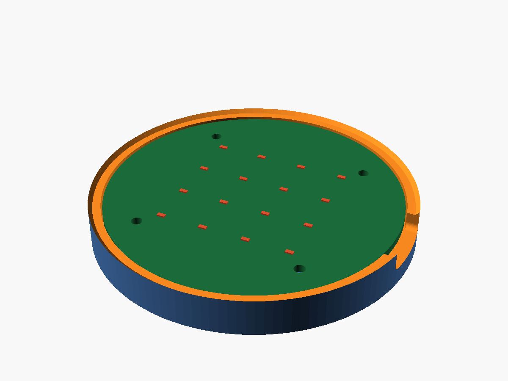
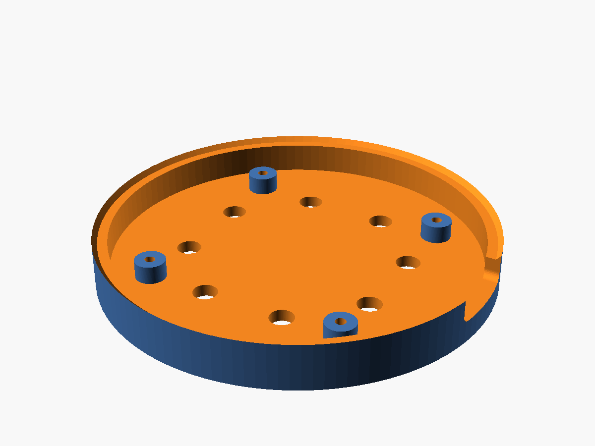

# MorphCPU

<!-- ==================================================================== -->
<!-- WRITE THIS YOURSELF                                                  -->
<!-- One-line tagline for the project. Everything in this file wrapped in -->
<!-- a "WRITE THIS YOURSELF" marker is deliberately left blank - the      -->
<!-- submission rules do not allow AI-generated prose in the README.      -->
<!-- Tables, headings, commands and part numbers below are generated;     -->
<!-- all narrative text is yours.                                         -->
<!-- ==================================================================== -->

_TAGLINE GOES HERE_

## What it is

<!-- WRITE THIS YOURSELF -->
<!-- 2-3 paragraphs in your own words. Suggested ground to cover:         -->
<!--   - what the thing physically is (a small round FPGA board)          -->
<!--   - what makes it different from a normal processor                  -->
<!--   - why you wanted to build it                                       -->
<!-- Do not paste anything from the other docs in this repo - those are   -->
<!-- AI-written and would defeat the point.                               -->

_WRITE THIS SECTION._

## How it works

<!-- WRITE THIS YOURSELF -->
<!-- Your own explanation of the concept. Reference material you can work -->
<!-- from, but must not copy:                                             -->
<!--   - gateware/README.md   cell ops, routing, the grid map             -->
<!--   - hardware/DESIGN.md   power tree and board architecture           -->
<!-- Facts you may want to state: 4x4 grid, 16 cells, each cell holds one -->
<!-- of 4 operations plus one of 4 routing directions, one tick moves     -->
<!-- data one cell, the topology is loaded over USB.                      -->

_WRITE THIS SECTION._

## Status

| Area | Status | Notes |
|---|---|---|
| Concept / architecture | 🟢 Done | Cell ISA and routing scheme defined and simulated |
| Gateware | 🟢 Done | 4×4 fabric, UART config loader, LED taps |
| Simulation / testbenches | 🟢 Done | 18/18 checks passing under Icarus Verilog |
| Synthesis / bitstream | 🔴 Blocked | Flow written, not run — OSS CAD Suite not installed |
| Electrical design | 🟢 Done | All 8 datasheet items resolved and cited |
| Schematic | 🟢 Done | ERC clean, 0 errors 0 warnings |
| PCB layout | 🟡 In progress | Placement done and DRC-clean; routing is manual |
| Gerbers | ⚪ Not started | |
| Case | 🟢 Done | Parametric OpenSCAD, STL + 3MF exported |
| BOM | 🟡 In progress | 8 parts verified with prices; passives still to pin |
| Bring-up | ⚪ Not started | |

**Legend:** ⚪ Not started · 🟡 In progress · 🟢 Done · 🔴 Blocked

### Next up

- [ ] Draw the schematic in KiCad
- [ ] Install the OSS CAD Suite and run `gateware/build.sh` for real LUT/Fmax numbers
- [ ] Lay out the board, LED grid dead centre
- [ ] Export gerbers to `hardware/fab_output/`

## Hardware

| Block | Part | Package | LCSC |
|---|---|---|---|
| FPGA | ICE40UP5K-SG48I | QFN-48-EP (7×7) | [C2678152](https://www.lcsc.com/product-detail/C2678152.html) |
| USB–UART bridge | FT231XS-R | SSOP-20-150mil | [C132160](https://www.lcsc.com/product-detail/C132160.html) |
| SPI config flash | W25Q32JVSSIQ (32 Mbit) | SOIC-8-208mil | [C179173](https://www.lcsc.com/product-detail/C179173.html) |
| USB-C receptacle | TYPE-C-31-M-12 | SMD, 16-pin | [C165948](https://www.lcsc.com/product-detail/C165948.html) |
| 3.3 V regulator | ME6211C33M5G-N | SOT-23-5 | [C82942](https://www.lcsc.com/product-detail/C82942.html) |
| 1.2 V regulator | ME6211C12M5G-N | SOT-23-5 | [C236672](https://www.lcsc.com/product-detail/C236672.html) |
| Clock | 1532H4-16000JWPDTSNL, 16 MHz XO | SMD3225-4P | [C5383161](https://www.lcsc.com/product-detail/C5383161.html) |
| Status LEDs | KT-0603R × 16 | 0603 | [C2286](https://www.lcsc.com/product-detail/C2286.html) |

Board: round, 70 mm diameter, 2-layer, JLCPCB SMT assembled.

Full electrical design in **[hardware/DESIGN.md](hardware/DESIGN.md)** ·
costed BOM in **[docs/BOM.md](docs/BOM.md)**.

## Gateware

| Cell op | Result | | Routing dir |
|---|---|---|---|
| `0` PASS | `a` | | `0` North |
| `1` INV | `~a` | | `1` East |
| `2` ADD | `a + b` | | `2` South |
| `3` XOR | `a ^ b` | | `3` West |

```
        c0    c1    c2    c3
      +-----+-----+-----+-----+
  r0  |  0  |  1  |  2  |  3  |  -> result out
      +-----+-----+-----+-----+
  r1  |  4  |  5  |  6  |  7  |  -> result out
      +-----+-----+-----+-----+
  r2  |  8  |  9  | 10  | 11  |  -> result out
      +-----+-----+-----+-----+
  r3  | 12  | 13  | 14  | 15  |  -> result out
      +-----+-----+-----+-----+
         ^
     data in
```

Run the testbenches (needs only Icarus Verilog):

```sh
cd gateware/sim
./run_sims.sh
```

Build a bitstream (needs the OSS CAD Suite):

```sh
cd gateware
./build.sh
```

Protocol, cell semantics and a worked example: **[gateware/README.md](gateware/README.md)**.

## Case



Parametric OpenSCAD, exported to STL and 3MF: **[case/](case/)**.

```sh
cd case
./export.sh
```

## Repository layout

| Path | Contents |
|---|---|
| [gateware/](gateware/) | Verilog: cell logic, routing fabric, UART config loader |
| [gateware/sim/](gateware/sim/) | Testbenches |
| [hardware/](hardware/) | Electrical design spec; KiCad project when it exists |
| [case/](case/) | OpenSCAD source + exported STL/3MF |
| [docs/](docs/) | BOM, datasheet links, images |
| [JOURNAL.md](JOURNAL.md) | Build log |

## Screenshots

<!-- WRITE THIS YOURSELF -->
<!-- Captions for each image are yours to write. Drop new images into     -->
<!-- docs/img/ and add them here. Worth capturing:                        -->
<!--   - GTKWave trace of a value rippling across the grid                -->
<!--   - nextpnr utilisation output once the bitstream builds             -->
<!--   - KiCad schematic sheets and the PCB 3D view                       -->
<!--   - the assembled board with the LED grid mid-computation            -->

### Case render



_CAPTION GOES HERE._

<!-- ==================================================================== -->
<!-- Add schematic / PCB / bring-up screenshots here as they exist.       -->
<!-- ==================================================================== -->

## Building it yourself

<!-- WRITE THIS YOURSELF -->
<!-- Any assembly notes, ordering notes, or warnings in your own words.   -->

_WRITE THIS SECTION._

## Licence

<!-- WRITE THIS YOURSELF - pick a licence -->

_CHOOSE A LICENCE._
