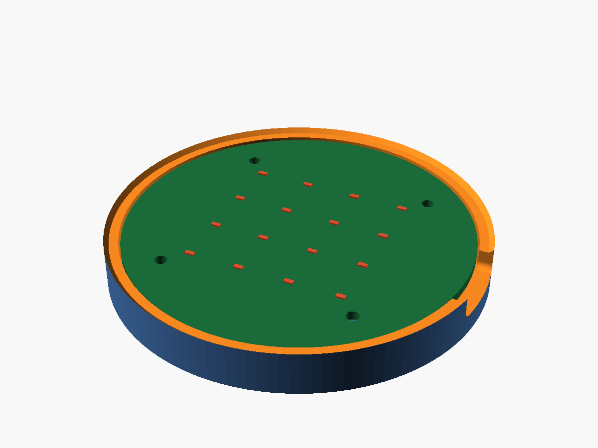

# case/

An open-face frame in parametric OpenSCAD. The board sits on four posts and
screws down. There is no lid or cover over the LEDs.



It is 75.4 mm across, 7.8 mm tall, with 2.4 mm walls and 3 mm under the board
for back-side parts. The 75.4 mm comes from a 70 mm board, 0.3 mm fit clearance
on each side and the two walls, so it changes if any of those dimensions do.

```sh
./export.sh
OPENSCAD="/c/Program Files/OpenSCAD (Nightly)/openscad.com" ./export.sh   # not on PATH
```

variants without exporting:

```sh
openscad -D 'part="assembly"' morphcpu_case.scad
openscad -D 'part="frame"'    morphcpu_case.scad
openscad -D 'part="pcb"'      morphcpu_case.scad
```

## board dimensions

The PCB hasnt been made yet, so these are assumptions, not measurements.

| param | assumed | comes from |
|---|---|---|
| `pcb_dia` | 70.0 mm | final board outline |
| `pcb_thickness` | 1.6 mm | JLCPCB default stackup |
| `mount_hole_r` | 29.0 mm | bolt circle |
| `mount_hole_count` | 4 | layout |
| `mount_hole_angle_offset` | 45 deg | layout |
| `usb_angle` | 0 deg (+X edge) | where the connector ends up |
| `usb_z_centre` | 1.2 mm above board top | connector datasheet + placement |

Update those seven values after routing, then run `export.sh` again.

## STEP

OpenSCAD wont do it. the CLI does `stl, off, wrl, amf, 3mf, csg, dxf, svg, pdf,
png` and thats the lot, its a mesh modeller and STEP is B-rep

`morphcpu_case.step` is the 3MF pushed thru FreeCAD 1.1.3, `Mesh.insert` then
`makeShapeFromMesh` with sewing then `Part.export`. it comes out a closed solid,
75.4 x 75.4 x 7.8mm, 11627.5mm3, 2621 faces. tessellated though, those faces are
mesh triangles welded up and not real cylinders. fine for a fit check, rebuild it
in Part Design or CadQuery if you need a proper one

## printing

no supports, flat on its back, 0.2mm layers, 3 perimeters. PLA unless it lives
somewhere warm

export prints genus 12 every time, four screw holes and eight vents. a
different number after a param change means two features started intersecting

`fit_clearance` is 0.3mm. print a test ring first, mine came out tight
